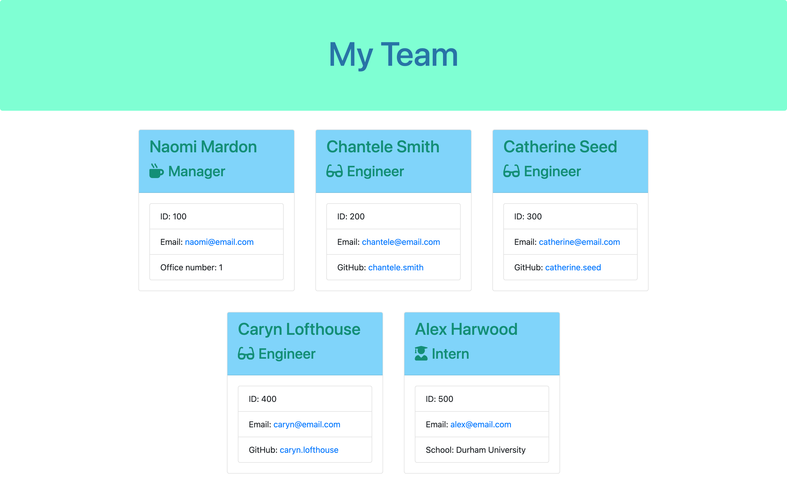

# Team-Profile-Generator
A Node.js command-line application to generate an HTML webpage displaying employee information

## Description 

This application takes in information about employees on a software engineering team and generates an HTML webpage displaying a profile for each employee so that the manager can quickly access information about them. 

A link to the generated HTML file can be found here: https://github.com/naomimardon/Team-Profile-Generator/blob/main/output/team.html

## Installation

1. Create a .gitignore file and add 'node_modules/' and '.DS_Store'
2. In the terminal run 'npm i inquirer@8'
3. In the terminal run 'node index.js'

## Usage 

1. Answer the questions provided
2. When all employees ahve been added, choose to finish building the team and an html file will be written to the output folder

Here is a screenshot of a completed webpage:

## Credits

Thank you to James Compagnoni for tutor support

## License

Please refer to the license in the repo

## Tests

17 tests were written for this application and all have been passed.

To run the tests:
1. In the terminal run 'npm i --save-dev jest'
2. In the terminal run 'npm run test'

